# Matplotlib画各种图的总结


数据可视化的图表种类繁多，各式各样，因此我们需要掌握如何在特定场景下使用特定的图表。 
数据可视化是为业务目的服务的，好的可视化图表可以起到清晰准确反映业务结果的目的，在选
择使用何种图表时，通常我们需要首先考虑你想通过可视化阐述什么样的故事，受众是谁，以及打算如何分析结果。

关于如何利用数据创造出吸引人的、信息量大的、有说服力的故事，进而达到有效沟通的目的，
可以进一步阅读这本书[《用数据讲故事》](https://book.douban.com/subject/27108685/)学习。

### 学习知识点概要

常见的场景分为5大类：

1）展示趋势变化（Evolution）

2）展示分布关系（Distribution）

3）展示相关关系（Correlation）

4）展示排序信息（Ranking）

5）展示组成关系（Part of a whole）

### 学习内容

#### 展示趋势变化的图

##### 1.折线图（Line chart）

```python
import matplotlib.pyplot as plt
import numpy as np
import pandas as pd

# 创建数据，分别对应X轴和Y轴，注意X轴要是有序排列的
df1=pd.DataFrame({'x1data': range(1,101), 'y1data': np.random.randn(100)})
df2=pd.DataFrame({'x2data': range(1,101), 'y2data': np.random.randn(100)})
df3=pd.DataFrame({'x3data': range(1,101), 'y3data': np.random.randn(100)})

# 设定式样，也可以选择其他的风格式样 seaborn-whitegrid
plt.style.use('seaborn-darkgrid')

# 创建调色板， 色卡用来控制每条线的颜色
palette = plt.get_cmap('Set1')

# 绘图，设置画布大小
plt.figure(figsize=(15, 7)) 
# color：    控制线条颜色，red/skyblue/blue 等
# alpha：    控制线条透明度
# linestyle：控制线条式样，"--"， "-"， "-."， ":" 等
# linewidth：控制线条粗细大小
# num用调色板改变颜色
num = 0
plt.plot('x1data', 'y1data', data=df1, marker='', color=palette(num), linestyle=':',  linewidth=2, alpha=0.9, label='data1')
num += 1
plt.plot('x2data', 'y2data', data=df2, marker='', color=palette(num), linestyle='-.', linewidth=2, alpha=0.9, label='data2')
num += 1
plt.plot('x3data', 'y3data', data=df3, marker='', color=palette(num), linestyle='--', linewidth=2, alpha=0.9, label='data3')

# 画出label名在图中的位置
plt.legend(loc=1, ncol=3)  
plt.title("Multiple line plot", loc='center', fontsize=12, fontweight=0, color='orange')
plt.xlabel("xdata")
plt.ylabel("ydata")
plt.show()
```

画出的多折线图如下：

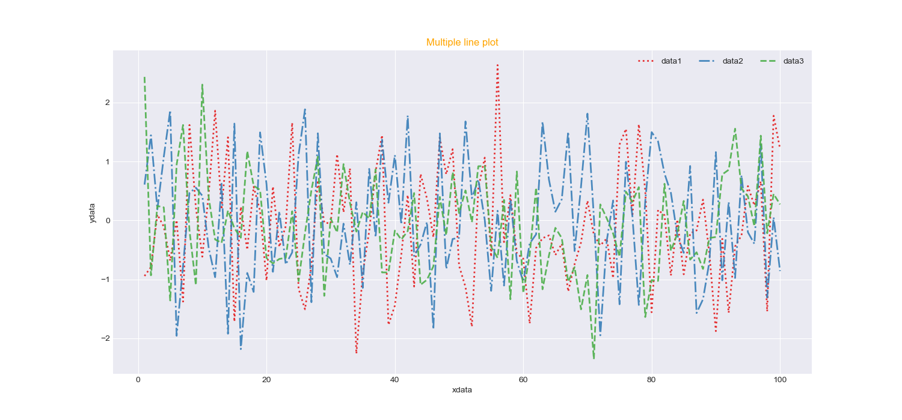

##### 2.面积图（Area chart）

```python
import numpy as np
import matplotlib.pyplot as plt
 
# 创建数据
x = range(1, 15)
y = [1, 4, 6, 7, 4, 9, 3, 2, 4, 1, 5, 4, 8, 7]

# 设定式样，也可以选择其他的风格式样 seaborn-whitegrid
plt.style.use('seaborn-darkgrid')
plt.figure(figsize=(20,10))

# 绘图
# facecolor：控制填充颜色，red/skyblue/blue 等
# alpha：    控制填充透明度
# hatch:     控制阴影式样{'/', '\', '|', '-', '+', 'x', 'o', 'O', '.', '*'}
plt.subplot(1,2,1)
plt.fill_between(x, y, facecolor="skyblue", alpha=0.4, hatch='/')
plt.title('Area without line')

# 在填充的基础上，添加一条折线，图形更加清晰
plt.subplot(1,2,2)
plt.fill_between(x, y, facecolor="skyblue", alpha=0.2, hatch='/')
# 画线 
plt.plot(x, y, color="skyblue", alpha=0.6, linewidth=1.5)  
plt.title('Area with line')
plt.show()
```

画出的面积图如下：

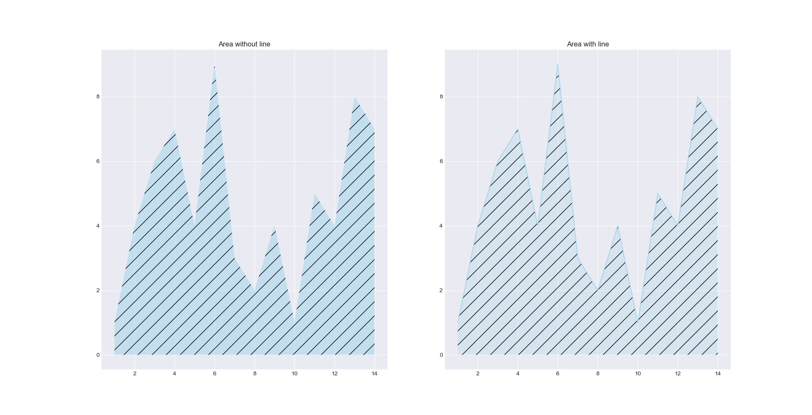

##### 3.堆积面积图（Stacked area chart）

堆积面积图是基础面积图的一个延伸，它将多个类别的数据变化都显示在了一个图形中。

它有以下特点：
1. 不同于多折线图的线条可能相互交叉，堆积面积图不会出现不同分类的数据点被遮盖、被隐藏的状况。每个类别都是都是堆积在下面类别面积图之上的。
2. 堆积面积图与标准面积图不同，某一分类的值并非与纵坐标完全对应，而是通过折线之间的相对高度来表达。
3. 堆积面积图不仅可以展示各类的发展趋势(面积图和折线图都能表示这个)， 可以表达总体的发展趋势和个种类间的关系，比如重要程度，大致占比等。

```python
import numpy as np
import matplotlib.pyplot as plt

# 风格
plt.style.use('seaborn-darkgrid')  
# 画布大小
plt.figure(figsize=(10, 6))   

# 定义x，y值
x = range(1, 6)
y = [[1, 4, 6, 8, 9], [2, 2, 7, 10, 12], [2, 8, 5, 10, 6]]

# 绘图，数据输入方式可以是一个X和多个Y，也可以将多列Y的数据合并成一个
plt.stackplot(x, y, colors=['blue', 'green', 'red'], labels=['A', 'B', 'C'])
plt.legend(loc='upper left')
plt.title('Stacked Area')
plt.show()
```

画出的堆积面积图如下：

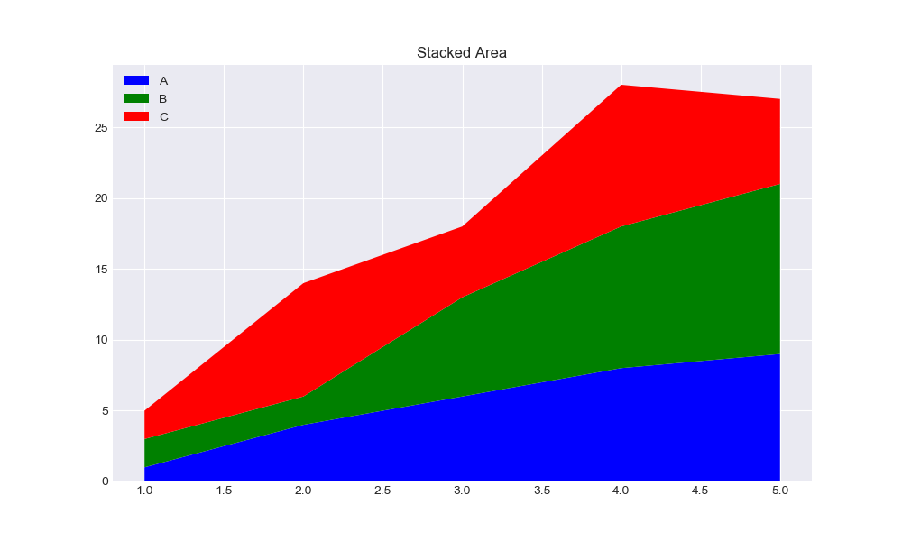

#### 展示分布关系的图

##### 1.小提琴图（Violin plot）

小提琴图是用来展示多组数据的分布状态以及概率密度。这种图表结合了箱形图和密度图的特征。
小提琴图的功能与箱型图类似。 它显示了一个（或多个）分类变量多个属性上的定量数据的分布，
从而可以比较这些分布。与箱形图不同，其中所有绘图单元都与实际数据点对应，小提琴图描述了
基础数据分布的核密度估计。

注意事项：
1. 不适合展示只有很少组别的数据。
2. 按照中位数排序能让数据看起来更直观。

小提琴图可以用seaborn包的violinplot方法实现。
具体代码可查看[示例](https://seaborn.pydata.org/generated/seaborn.violinplot.html?highlight=violinplot#seaborn.violinplot)。

##### 2.箱型图（Box plot）

箱形图（或盒须图）以一种利于变量之间比较或不同分类变量层次之间比较的方式来展
示定量数据的分布。矩形框显示数据集的上下四分位数，而矩形框中延伸出的线段（触
须）则用于显示其余数据的分布位置，剩下超过上下四分位间距的数据点则被视为“异常值”。

箱型图的基本作用如下：

1. 数据异常值。箱形图为我们提供了识别异常值的一个标准：异常值被定义为小于Q1－1.5IQR或大于Q3+1.5IQR的值。
2. 偏态和尾重。箱型图揭示了数据批分布偏态和尾重的部分信息，尽管它们不能给出偏态和尾重程度的精确度量，但可作为我们粗略估计的依据。
3. 数据的形状。同一数轴上，几批数据的箱形图并行排列，几批数据的中位数、尾长、异常值、分布区间等形状信息便一目了然。在一批数据
中，哪几个数据点出类拔萃，哪些数据点表现不及一般，这些数据点放在同类其它群体中处于什么位置，可以通过比较各箱形图的异常值看出。

注意事项：
1. 箱型图隐藏了每个分组的数据量信息，可以通过标注或箱子宽度来展现。
2. 箱型图隐藏了背后的分布信息，当数据量较少时可以使用数据抖动(jitter),当数据量较大时可以使用小提琴图来展现。

箱型图可以直接使用seaborn的boxplot方法来实现。
具体代码可查看[示例](https://seaborn.pydata.org/generated/seaborn.boxplot.html?highlight=boxplot#seaborn.boxplot)。

##### 3.直方图（Histogram）

```python
import seaborn as sns
import matplotlib.pyplot as plt
from sklearn.datasets import load_boston
boston=load_boston()
y = boston['target']

# 获取图和坐标轴
f, axs = plt.subplots(3, 1, figsize=(10, 10))
# 计数标准直方图，axs[0,1,2]表示三个不同坐标的图
sns.histplot(y, stat='count', ax=axs[0])
# 归一化的直方图
sns.histplot(y, stat='probability', ax=axs[1])
# 在直方图上同时画出密度曲线, kde为计算核密度估计去平滑分布然后画出一条线
sns.histplot(y, stat='probability', kde=True, ax=axs[2])
plt.show()
```

画出的堆积面积图如下：

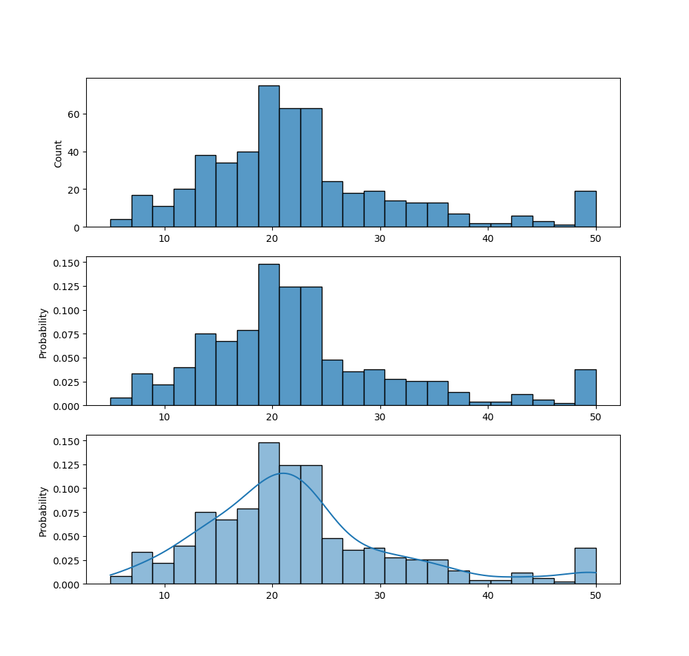

##### 4.密度图（Density）

```python
import seaborn as sns
import matplotlib.pyplot as plt
import numpy as np

# kdeplot()中的bw参数控制着估计值与真实数据之间的贴近程度
# 它与我们的KDE图的宽度相关。它提供了默认的规则来确定一个取值
x = np.random.normal(size=100)
sns.kdeplot(x, label="bw: default")
sns.kdeplot(x, bw_method=0.2, label="bw: 0.2")
sns.kdeplot(x, bw_method=2, label="bw: 2")
plt.legend()
plt.show()
```

画出的堆积面积图如下：

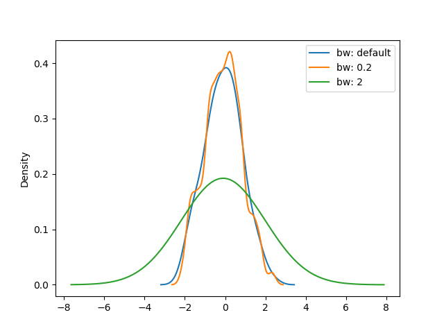
   
#### 展示相关关系的图

##### 1.散点图（Scatter plot）

散点图常用于查看数值型变量之间的相关性，同时可以利用不同颜色来区分样本所属的类别。

注意事项:
1. 绘制散点图时要避免Overplotting，意思是由于散点数量过多导致图中的样例点过度重合。
2. 为了避免overplotting，第一种方式可以通过抽样来作图，第二种方式可以用热力图代替，第三种方式是调节样本点的size。

```python
import seaborn as sns
import matplotlib.pyplot as plt
from sklearn.datasets import load_boston
boston=load_boston()

# 绘制标准散点图, s为点的大小
plt.scatter(boston['data'][:, 0], boston['target'], s=0.2)
plt.show()
```

画出的散点图如下：

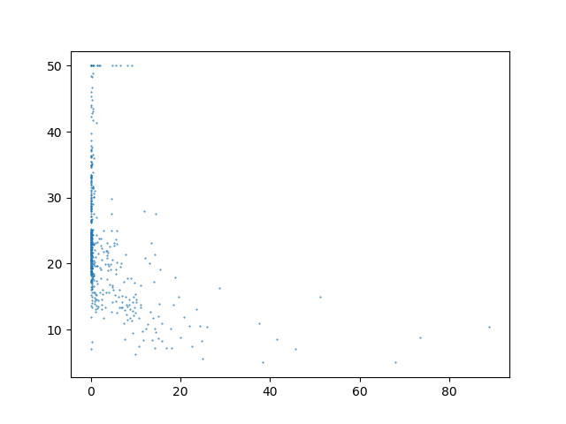

##### 2.热力图（Heatmap）

密度图对于一组数值变量，可以理解为先对其进行二维分箱，再分别统计每个箱子的对应指标；
对于分类变量而言，箱子一般可以指定为对应的类别。但通常，热力图更多用来表示数值变量的总体信息。

注意事项:
1. 考虑到长尾分布等情况，经常需要对数据做标准化的预处理 。
2. 经常需要对数据先进行分箱再绘图，对于类别变量而言，可以进行类别的合并；同时对于数值变量而言，既可以包含分位数分箱，也可以包含等间隔分箱。

```python
import matplotlib.pyplot as plt
import numpy as np; np.random.seed(0)
import seaborn as sns; sns.set_theme()
uniform_data = np.random.rand(10, 12)
ax = sns.heatmap(uniform_data)
plt.show()
```

画出的热力图如下：

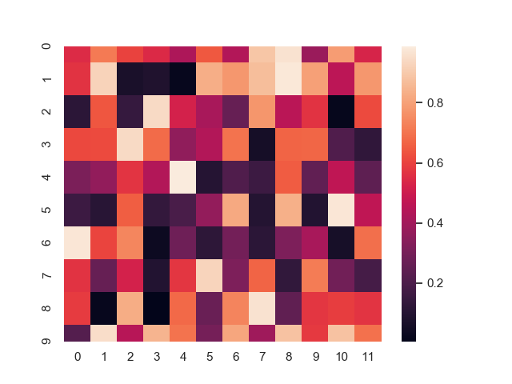


##### 3.气泡图（Bubble plot）

气泡图适用于超过二维特征的可视化，一般可以用气泡的颜色和大小来表示第三维、第四维的特征，可以认为气泡图是散点图的衍生。

注意事项:
1. 使用气泡面积而不是气泡的直径作为数值指标对比。
2. 和散点图类似，气泡图同样要注意overplotting的问题。

```python
import numpy as np
import matplotlib.pyplot as plt
from sklearn.datasets import load_boston
boston=load_boston()
# 用气泡大小显示该feature大小
new_feature1 = np.random.randint(0, 10, 10)  
# 用气泡深浅显示该feature大小
new_feature2 = np.random.randint(0, 10, 10)  
plt.scatter(boston['data'][0:10, 0], boston['target'][0:10], s=new_feature1*100, c=new_feature2,
            cmap="Blues", alpha=0.8, edgecolors="grey", linewidth=2)
plt.show()
```

画出的气泡图如下：

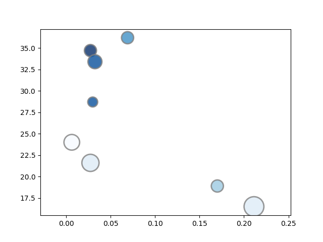

#### 展示排序信息的图

##### 1.柱状图（Barplot）

柱状图用来展示一个类别变量和一个数值变量之间的关系，每个柱子代表一个类别，
柱子的长度代表这个类别的数值。通常来说，柱状图是展示此类信息最有效的方式之一。

注意事项：
1. 不要和直方图混淆。直方图一般横轴是数值区间。
2. 类别标签较长时，可以采用横向柱状图。
3. 给柱子排序通常更有利于展示信息。

```python
import matplotlib.pyplot as plt

height = [0, 1, 2, 3, 4 ,5, 6, 7, 8, 9]
x_data = [11,12,13,14,15,16,17,18,19,20]
plt.bar(x_data, height)
plt.show()
```

画出的柱状图如下：

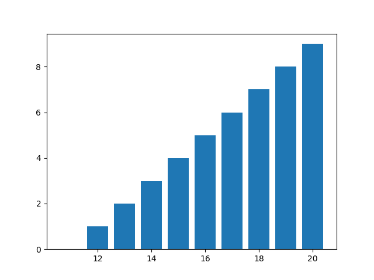

##### 2.雷达图（Radar）

雷达图是一种展示多个定量变量的二维图表，所有变量交汇在中心同一点，由于使用限制较多，在可视化中一般较少用到。

注意事项:
1. 不要在一张图显示超过5个组别。
2. 当不同组别标度差别很大时，谨慎使用雷达图。

可以使用极坐标系和多边形填充的方式绘制雷达图。

##### 3.平行坐标图（Parallel coordinates）

平行坐标图用来比较样本在一组数值型变量上的特征，它是雷达图的另一种表现形式，在可视化中更推荐被使用。

注意事项:
1. 不适合用于组别过多的情况。
2. 可以在X轴对数据排序，避免曲线之间的交叉。

可以通过pandas.plotting中的parallel_coordinates方法绘制平行坐标图。

##### 4.棒棒糖图（Lollipop）

棒棒糖图本质上是柱状图的另一种表现形式，区别是把柱子用线和点来代替，但是从视觉上表现效果更好。

注意事项：
1. 排序会使得显示效果更好
2. 如果因为某种原因不能保持排序状态，那么宁愿选择柱状图

```python
import matplotlib.pyplot as plt

x_data = [10, 22, 35, 56, 101]
label = ['x1_data', 'x2_data', 'x3_data', 'x4_data', 'x5_data']
plt.hlines(label, xmin=0, xmax=x_data, color='skyblue')
plt.plot(x_data, label, 'o')
plt.show()
```

画出的棒棒糖图如下：

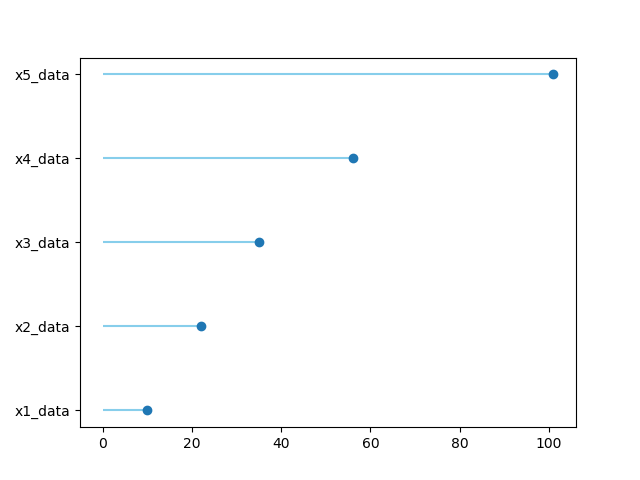

##### 5.圆形柱状图（Circular barplot）

圆形柱状图相比于柱状图更吸引眼球，但同时也更难识别出柱子尺寸的差别，
因此只有当你有大量类别需要展示，并且有一些明显突出的类别时才会使用。

注意事项：

1. 内圈的比例不能太小，一般须超过外圈的三分之一 。
2. 通常只有当你有很多类别需要展示时才会用（>40）。

在matplotlib中，可以通过极坐标系下的柱状图加上内圈的圆来绘制圆形柱状图。

#### 展示组成关系的图

##### 1.饼图（Pie chart）

饼图在图像上是一个被分成若干部分的圆，用于反映每个部分对于整体所占的比重。

注意事项：
1. 如果使用百分数，确保它加起来是100%。
2. 不要使用3d和图例，使得图的阅读性更差。

饼图可以直接用pyplot.pie函数绘制，也可以调用pandas库的绘图接口dataframe.plot。

```python
# 绘制Pie chart
import matplotlib.pyplot as plt
import numpy as np
import pandas as pd

# 1*1画布
fig, ax = plt.subplots()  
# 3*2 array
vals = np.array([[60., 32.], [37., 40.], [29., 10.]])  
# wedge object 控制圆环的宽度，axis为加和的方向
ax.pie(vals.sum(axis=1))  
plt.show()

# 定义数据，4组，每组设定一个值: 
df = pd.DataFrame([8, 8, 1, 2], index=['a', 'b', 'c', 'd'], columns=['x'])
# 开始绘画
df.plot(kind='pie', subplots=True, figsize=(8, 8))
plt.show()
```

画出的饼图如下：

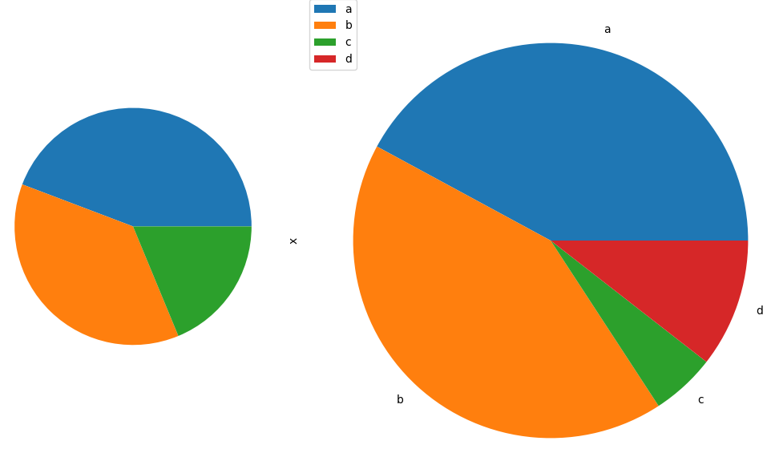

##### 2.甜甜圈图（Donut chart）

甜甜圈图和饼图极为类似，都是用来反映几个对象的组成比例，因而也有着相似的注意事项。

注意事项：
1. 如果使用百分数，确保它加起来是100%。
2. 不要使用3d和图例，使得图的阅读性更差。

在绘图时可以通过在饼图的中心画一个和底色相同的同心圆方式来绘制。

```python
import matplotlib.pyplot as plt

# 定义数据：有三个大组和七个小组
group_names = ['groupA', 'groupB', 'groupC']
group_size = [12, 11, 30]
subgroup_names = ['A.1', 'A.2', 'A.3', 'B.1', 'B.2', 'C.1', 'C.2', 'C.3', 'C.4', 'C.5']
subgroup_size = [4, 3, 5, 6, 5, 10, 5, 5, 4, 6]

# 定义颜色
a, b, c = [plt.cm.Blues, plt.cm.Reds, plt.cm.Greens]

# 第一个环（外环）
fig, ax = plt.subplots()
ax.axis('equal')
mypie, _ = ax.pie(group_size, radius=1.3, labels=group_names, colors=[a(0.6), b(0.6), c(0.6)])
plt.setp(mypie, width=0.3, edgecolor='white')

# 第二个环（内环）
mypie2, _ = ax.pie(subgroup_size, radius=1.3 - 0.3, labels=subgroup_names, labeldistance=0.7,
                   colors=[a(0.5), a(0.4), a(0.3), b(0.5), b(0.4), c(0.6), c(0.5), c(0.4), c(0.3), c(0.2)])
plt.setp(mypie2, width=0.4, edgecolor='white')
plt.margins(0, 0)

plt.show()
```

画出的甜甜圈图如下：

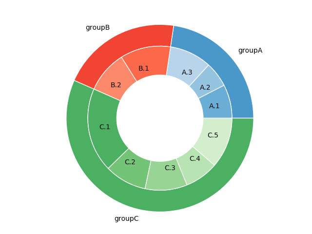

##### 3.文氏图（Venn diagram）

文氏图用于表示不同集合的有限集合之间所有可能的逻辑关系，每个集合用一个圆表示，圆的大小反映了该组的
重要性，组与组之间通常会有交叠，交叠的部分体现了不同组之间的交叉数据。

注意事项：
1. 不建议绘制超过3个集合的venn图，超过3个集合的venn图不便于理解。
2. 图中的数字指代集合之间交集的元素个数。

文氏图可以利用matplotlib_venn包中的venn2和venn3方法绘制两个集合或三个集合的之间的逻辑关系。文氏图的数据类型可以是set或tuple。

venn2方法中可以指定两个set的取值，venn2方法中可以指定3个set的取值
可以通过一个tuple指定集合之间的重叠关系，且在venn2方法中tuple只有前3个元素会被用于venn图绘制，在venn3方法中tuple只有前7个元素会被用于venn图绘制。

##### 4.树图（Treemap）

树图将数据显示为一组嵌套的矩形，通过矩形的面积反映其取值大小，使用配色方案，可以表示多个维度:组、子组。
树图的优势是充分利用了空间，使得在有限的空间内展示大量数据。

注意事项：
1. 不要在层次结构中注释超过3个级别，这会使图形不可读。
2. 优先考虑层次结构的最高层次。

可以使用squarify包绘制树图，squarify的底层代码也是基于matplotlib实现的。

### 学习思考与总结

本文的总结主要是简单汇总python可实现的不同的图，内容并不完整，更多内容需要查看官网相关示例才能知晓。

参考资料：

[matplotlib官网](https://matplotlib.org/stable/index.html)

[seaborn官网](https://seaborn.pydata.org/index.html)


