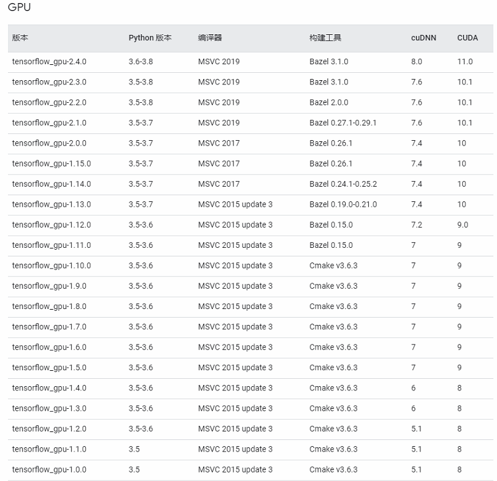

# win10上Tensorflow+CUDA安装


CUDA是一种由NVIDIA推出的通用并行计算架构，该架构使GPU能够解决复杂的计算问题。
包含了CUDA指令集架构（ISA）以及GPU内部的并行计算引擎。

### CUDA安装

首先查看tensorflow[官网](https://www.tensorflow.org/install/source_windows) 上测试过可行的相对应的版本:



然后，根据自己当前环境的要求，进入[链接](https://developer.nvidia.com/cuda-toolkit-archive) 选择相应的CUDA版本下载

安装到自己想要的路径下，然后一直下一步。

### CUDA编译

下载好之后需要用Visual Studio软件将CUDA编译生成相应的可执行文件

### tensorflow安装

用pip安装tensorflow指定版本

` pip install tensorflow-gpu==1.15.4 `
   
### tensorflow用GPU进行运算测试

代码如下：
```python
import tensorflow as tf
a = tf.constant([1.0, 2.0, 3.0, 4.0, 5.0, 6.0], shape=[2, 3], name='a')
b = tf.constant([1.0, 2.0, 3.0, 4.0, 5.0, 6.0], shape=[3, 2], name='b')
c = tf.matmul(a, b)
sess = tf.Session(config=tf.ConfigProto(log_device_placement=True))
print sess.run(c)
```

本文简单总结，具体查看参考资料内容。

参考资料：

https://docs.nvidia.com/cuda/cuda-installation-guide-microsoft-windows/index.html
https://blog.csdn.net/ccnucb/article/details/79873460

